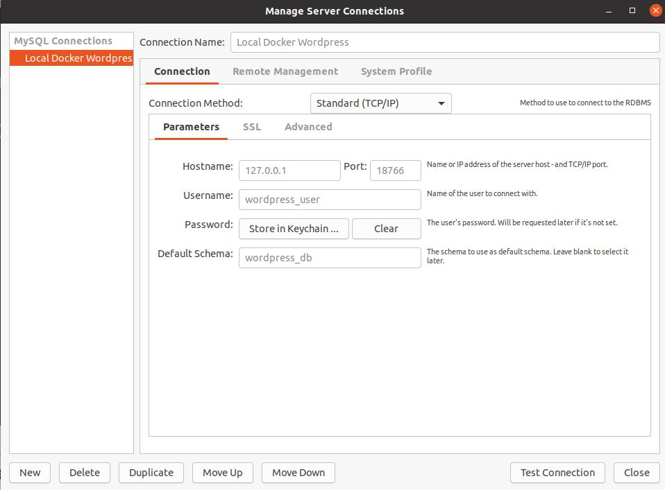

When working on a solution for [Wordpress](https://wordpress.org/), a local development environment is a great way to manage code repositories and keep things quick - with room to experiment. I have friends who still use plain old css, and work off a server using SFTP like some sort of pirate. I don't know how they have managed it for so long. I couldn't live with out services such as SASS, Webpack, Parcel, Babel and ES6, and most of the solutions that lead us to today (has anyone heard from gulp in a while? ).

Part of my older web developer friends issue is the fear of the command line and the idea that running a local server is daunting.

My go-to local environment for the last seven years has usually been MAMP Pro. It allows me to add as many custom domains as I need to (with SSL) and I am up and running in minutes with the choice of Apache and Nginx. Great! This is especially handy if I need two Wordpress instances running at once.

As it always happens, I recently employed Virtualbox to fire up a few virtual Linux servers while run tests and writing scripts for an app I am working on.  This has always worked out OK, but it isn't all that efficient and a lot of time is wasted experimenting and refreshing images. There will always be a place for them as far as I can see it, just not for those times when I trying a new technology or firing up a temporary server.

After reading and hearing about Docker for what feels like years, I finally took the time to wrap my head around it.

Docker gives you the ability to house server based applications in containers on your local machine. This has given me the ability to try anything from a basic web server to unique FFMPEG builds with no trouble and a lot faster. More often than not, without all the heavy lifting and package management that comes with custom server based solutions.

Making things even easier again, there is docker-compose.

Docker Compose allows for quick deployment with predefined settings. This basically means you can run pre-built containers with the files required to run server based applications, without the need to fire up an entire server. You can even create a small virtual network between them with little no configuration. 

It is all a little daunting at first, and I am far from having mastered it but have enjoyed it since I finally found the time to wrap my head around it. The great thing is loads and loads of more talented people have shared their configurations 

Recently, I found myself swinging back into the land of the Linux desktop - it happens every few years, usually around the time Ubuntu releases a long term release. I am always working on Linux servers, but the idea of working with software created with such passion and for the love of it is always a enticing.

I have been working with an Ubuntu 20.04 based laptop where [MAMP](https://www.mamp.info/en/windows/) isn't available. I would normally configure Apache or Nginx with every new project, which becomes tiresome quickly and I have not found another solution that works as well or reliably. 

Well then! Before long I had built myself a docker compose file to quickly fire up a Wordpress development environment with a single command. I have used it with the last 15 projects without issue and am now using it across all platforms, Windows, Mac and Linux. Now I can have a wordpress installation up within a minute and can be coding moments later. 

I hope someone else out there might find some use with it. If you have any issues, feel free to reach out on [Twitter](https://twitter.com/nick_la_rosa) or [Github](https://github.com/n1cklarosa)

**This project leverages the work from done in the following three projects found on DockerHub**

[Mysql 5.7](https://hub.docker.com/r/ymnoor21/mysql5.7/)

[local-wordpress](https://hub.docker.com/r/alfiemx/local-wordpress)

[Wordpress CLI](https://hub.docker.com/_/wordpress)

### Requirements

- Docker Desktop - <a href="https://docs.docker.com/get-docker/" target="_blank">Get Docker</a> 
- Docker Composer - Windows and Mac users will have docker-compose available once Docker Desktop is installed. Linux users will need to follow the guide found <a href="https://docs.docker.com/compose/install/" target="_blank">here.</a> 
- Git - <a href="https://www.atlassian.com/git/tutorials/install-git">Installation instructions</a>

### Initial Setup

Clone this repo or download the zip directly then un-compress it.

Example command for clone.

```
git clone https://github.com/n1cklarosa/EasyWordpressDockerComposeEnvironment.git
```

###### For Mac and Linux

Using a terminal, navigate to a folder you want to house your project in, and run the following.

```git clone https://github.com/n1cklarosa/EasyWordpressDockerComposeEnvironment.git
cd EasyWordpressDockerComposeEnvironment
chmod 770 setup.sh
./setup.sh
```

`setup.sh` will create the required folders, download Wordpress then configure the wp-config.php for this project.

###### For Windows

You will need to create the following folders in the root of your project

/docker-compose/mysql

/wordpress

/themes

/plugins

Then [download](https://en-au.wordpress.org/latest-en_AU.zip) and unzip the Wordpress files to the /wordpress folder. You will need to update the wp-config.php details to match the following

```
define( 'DB_NAME', 'wordpress_db' );
define( 'DB_USER', 'wordpress_user' );
define( 'DB_PASSWORD', 'wordpress_password' );
define( 'DB_HOST', '127.0.0.1' );
```

### Usage

#### Starting Docker 

Run the following from the root of your project.

```
docker-compose up -d
```

Running the above for the first time will download the required docker containers, provided you don't happen to have them cached locally from another project. 

Once the above command is run, you should see a response like the following. 

```
Creating network "docker_default" with the default driver
Creating local-wordpress-db ... done
Creating local-wordpress    ... done
```

If all went well, you can now access your new Wordpress installation with the url http://localhost

To end your docker container, run the following from the root of your project. The local files used will still be in tact

```
docker-compose down
```

#### Connecting with MYSQL

The docker-compose file will setup a MYSQL server on port 18766 (this can be altered in the `docker-compose.yml` file). You can connect to the server using the following details

- Hostname: 127.0.0.1
- Username: wordpress_user
- Password: wordpress_password
- Schema: wordpress_db




#### Importing a .sql file using the Command Line

Example command using local mysql install (ie - not using a docker installation of mysql)

```/path/to/mysql -h 127.0.0.1 -u wordpress_user -p wordpress_dv < data.sql```

#### Finding Docker Container ID

To find the ID of your container, run the following command

```
docker ps
```

You will see an output like the following, we are looking for the wordpress:latest container. 

```
ed72061e0466        wordpress:latest    "docker-entrypoint.s…"   7 hours ago         Up 7 hours          0.0.0.0:80->80/tcp                   local-wordpress
3b2678b45ad2        mysql:5.7           "docker-entrypoint.s…"   7 hours ago         Up 7 hours          33060/tcp, 0.0.0.0:18766->3306/tcp   local-wordpress-db
```

You can see from our above example, that the container ID for wordpress is *ed72061e0466* and the database container is *3b2678b45ad2*

#### PHP Error monitoring

On mac and linux, you can use the following command to show a continuous reading of errors on your Wordpress install. Grab the ID from your wordpress container using the above instructions.

```
docker logs -f CONTAINER_ID 2>&1 >/dev/null | grep -i error
```

Swap CONTAINER_ID with the ID docker has assigned to your running container. Here is an example using the above example

```
docker logs -f ed72061e0466 2>&1 >/dev/null | grep -i error
```

#### WP Cli

Example setup of test instance using WP-Cli. This can be run after the setup.sh script to setup your wordpress instance.

```
docker-compose run wpcli wp core install --path=/var/www/html  --url=http://localhost --title="Local Wordpress" --admin_user=admin --admin_email=my@email.com --admin_password=mypassword 
```

#### Exporting the db using the command line

Using the instructions above, find your container ID for the local-wordpress-db  container(the example above shows *3b2678b45ad2*)

```
docker exec CONTAINER_ID /usr/bin/mysqldump -u root --password=somewordpress wordpress_db > backup.sql
```

Example of command with container ID from above example of `ps` output

```
docker exec 3b2678b45ad2 /usr/bin/mysqldump -u root --password=somewordpress wordpress_db > backup.sql
```