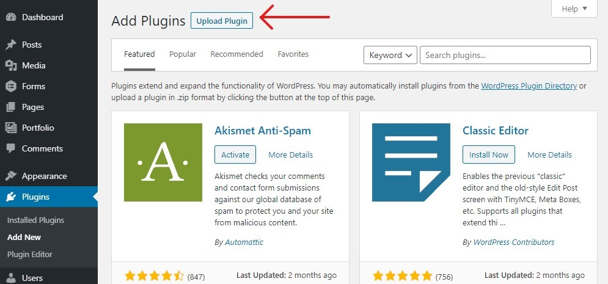
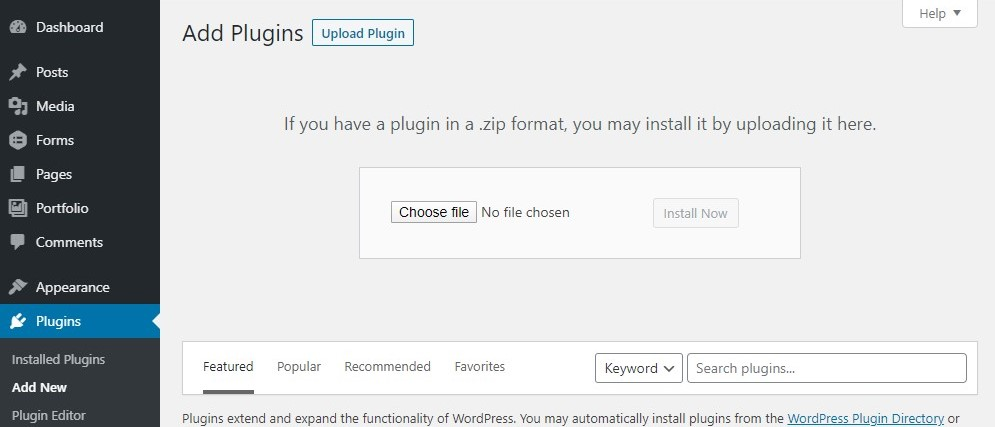
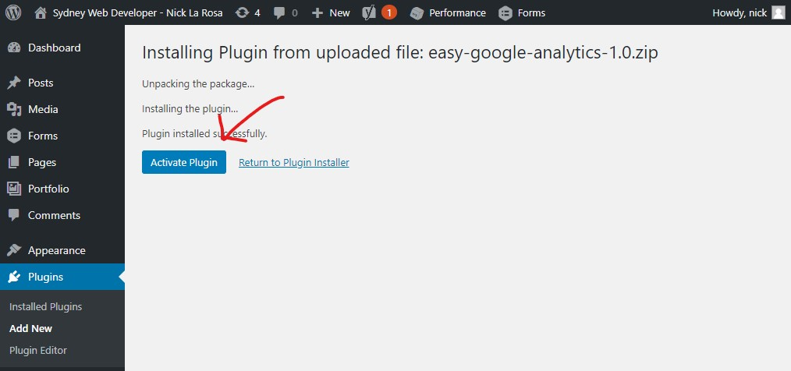

First thing to think of when attempting to install a downloaded wordpress plugin – if your website is hosted on wordpress.org, unfortunately you cannot add a plugin that is not listed in their Plugin directory. This guide is for any users who are installing a plugin not procured from the official Plugin directory and are using just about any other service to host their website.

So you have just downloaded a zip file containing your new plugin and you are keen to try it out. What now?

Whether you got it from an independent developer such as myself, or you have just paid for a Premium plugin from a wordpress developer, it should have come with a single zip file you can download.

Ok, so lets make this happen.

To start with, sign into the WordPress admin area and head to Plugins » Add New page. Then find and click the Upload Plugin button a the top of the page.

You should now see the plugin upload section. Simply drag and drop your zip file over the container reading Choose File. You may also click on Choose File and select the zip file containing the plugin from your available drives.

Then just click on the Install now button, which should bring you to the following screen (it might be a few seconds while your file is uploaded). Just click on Activate and you are done!

You can now hardness the new power of your latest plugin ! Pretty easy right?

Each plugin has its own way of doing its things. You might find a new section in your admin menu, or it might have its own screen hidden under the Settings section. It all comes down to the plugin you are using and its needs. Make sure you have read any info that came with the wordpress plugin to configure any necessary settings to your needs.
