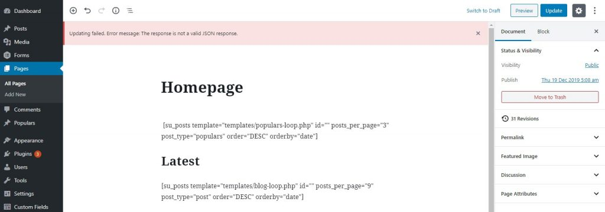
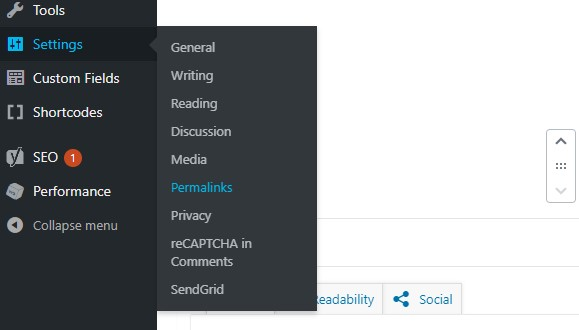
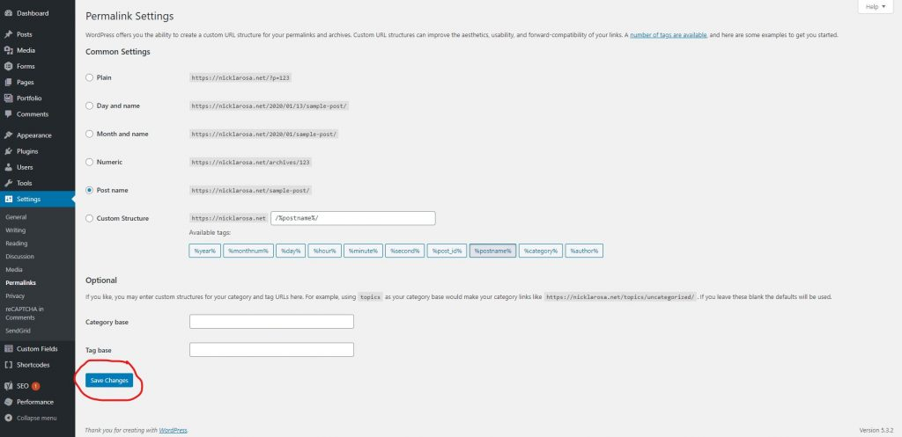

I have had a small support job come in a number of times since [WordPress](https://en-au.wordpress.org/) officially embraced Gutenburg. When trying to save a page the user receives a WordPress error “Updating failed”. The issue usually comes up after a wordpress upgrade, server upgrade, or server move but it can occasionally appear seemingly out of no where.

### The Issue

When trying to create or update a page, an error appear at the top of page

`Updating failed. Error Message: The response is not a valid JSON response`

### The Fix

Head to the **Settings** menu and select **Permalinks**.

rom there it is usually just a matter of pressing **Save Changes** and you are back in business. If this does not fix the issue you may have something a little more serious happening with your server configuration.

You will occasionally find a notice on the permalink page advising that changes cannot be made as the server does not have write access to a particular file (the .htaccess file). In this instance, it might be best to contact your host or web developer. If you are still having issues please feel free to contact me [here](https://nicklarosa.net/contact/). 