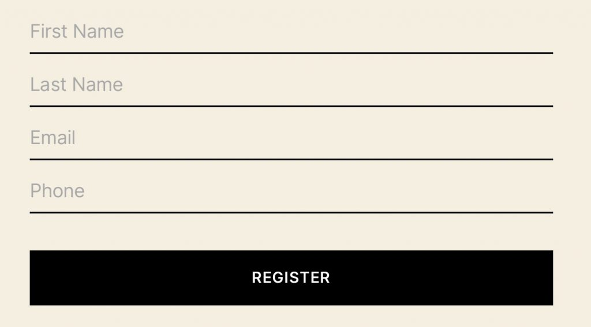

Simple Visitor Registration Form is a WordPress plugin which provides a physical venue the ability log visitors entering their building. The venue will then have an avenue to contact patrons if any relevant history relating to Covid-19 may arise.

With the use of a simple shortcode, one can easily build a form requesting the name, email and phone number of all patrons at your physical venue. Each entry will be logged along side the time entered.

The venue can easily print a notice for the entrance of their building requesting all visitors register before entering.

This is a completely free plugin I have built after a number of freelance jobs coming in requesting the same function for smaller local venues who are having a hard time getting and staying open.

A CSV file can be exported from the wordpress admin section which you can open in Excel or any spreadsheet software and sort through

<a href="https://simplevisitorregistration.nicklarosa.net/" target="_blank">Demo</a>

<a href="https://d32maysp7h0pq5.cloudfront.net/wp-content/uploads/2020/07/simple-visitor-registration.zip" target="_blank">Download Plugin – simple-visitor-registration.zip</a>

<a href="https://github.com/n1cklarosa/WP-Simple-Visitor-Registration-Form" target="_blank">Source code on github</a>

### Instructions

This plugin will provide the ability to add a form with the following shortcode from any WYSIWYG editor in wordpress. This will use some default styling, however, styles can be altered with a little CSS using custom attributes as detailed below.

`[visitor_registration_form]`

Once the above shortcode has been added to any wordpress page or post, you should see something like the following image on the front end of this content. This example is built using the TwentyTwenty theme provided with wordpress. It should work with any up to date wordpress install on any theme using a standard implementation.

### Customise

The following shortcode attributes can be used to customise the form without having to alter your theme. A custom field can also be added using the ‘customfield1’ option

`fnametext` – Customise the First Name placeholder text

`lnametext` – Customise the Last Name placeholder text

`emailtext` – Customise the Email Address placeholder text

`phonetext` – Customise the Phone Number placeholder text

`inputfieldbordertop` – Text fields top border css properties

`inputfieldborderleft` – Text fields left border css properties

`inputfieldborderright` – Text fields right border css properties

`inputfieldborderbottom` – Text fields bottom border css properties

`inputfieldfontsize` – Text field font size css properties

`inputfieldbackgroundcolor` – Text fields background color css properties

`inputfieldwidth` – Text fields width value css properties

`inputfieldlineheight` – Text field line height css properties

`inputfieldtextcolor` – Text field font color css properties

`inputfieldpadding` – Text field padding css properties

`inputfieldmargin` – Text field margin css properties

`buttoncolour` – Button font background color css properties

`buttontextcolor` – Button font color css properties

`buttonpadding` – Button padding css properties

`buttonmargin` – Button margin css properties

`buttonwidth` – Button width css properties

`errortextcolor` – Error text color css properties

`customfield1` – Name of an extra field eg. Room Number

`buttontext` – Customise the Register Button Text

Here is an example with all the customise options. None of them are mandatory, the option is there so you can try and align the form with your own theme and branding.

`[visitor_registration_form fnametext="First Name" lnametext="Surname" emailtext="Email Address" phonetext="Phone Number" customfield1="Company" inputfieldbordertop="0px solid black !important" inputfieldborderleft="0px solid black !important" inputfieldborderright="0px solid black !important" inputfieldborderbottom="2px solid black !important" inputfieldwidth="100%" inputfieldtextcolour="#000 !important" inputfieldpadding="10px 20px !important" inputfieldmargin="10px 0px !important" buttoncolour="#000 !important" buttontextcolour="#fff !important" buttonpadding="20px 20px !important" buttonmargin="10px 0px !important" buttonwidth="100% !important" buttontext="Register" errortextcolor="#fff !important"]`
