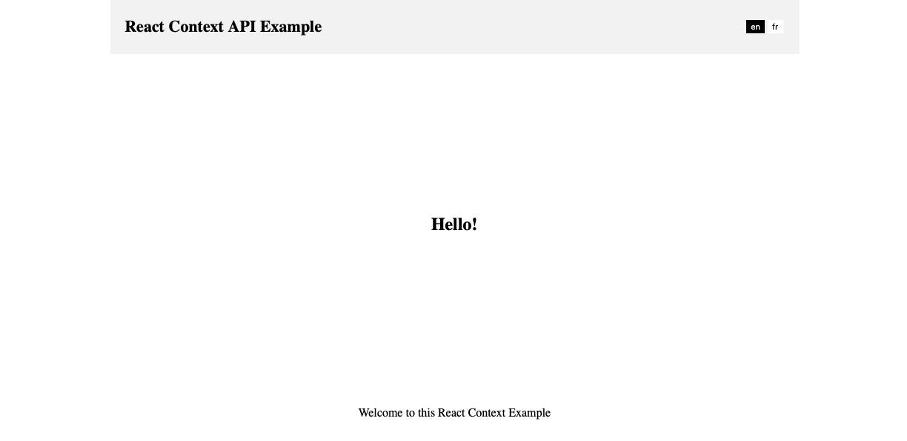
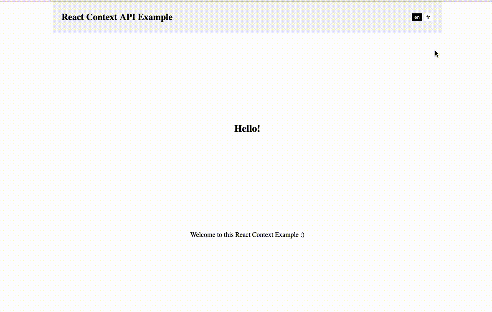

This tutorial may serve as an introduction into using the **React Context API** which will allow management of a global state while avoiding prop drilling. New comers to React Context API may find it makes life way easier.

My first React app back in 2017 went from a smooth start to a hellish final stretch. Largely thanks to the app complexity and the amount of Components that shared data via prop drilling. API calls were flying off left right an centre with data flowing through components up to 15 levels deep. Code management was a real nightmare in the end, and I learned a lot along the way. 

Then in early 2018, Brian Vaghn posted an article over at reactjs.org talking about [the new React Context API in React 16.3.0.](https://reactjs.org/blog/2018/03/29/react-v-16-3.html) This meant I no longer needed to pass data from component to component bloating my app. Delightfully, our code base was about 20% trimmer once we made the change.

So what is the **React Context API**? The official docs state the following:

> "Context provides a way to pass data through the component tree without having to pass props down manually at every level."

We can use this power for just about any global data you might want, be it a list of taxonomies, authentication tokens, a shopping cart or any javascript object you can imagine. 

In this example we will build a small language selector using React Context API. The user will be able to select between English and French, and our app will adapt accordingly by using our new global variables to display text in the relevant language.

An understanding of react hooks and function based components will help prior to starting this tutorial. If you have not had exposure to [`useState`](https://reactjs.org/docs/hooks-state.html) and [`useEffect`](https://reactjs.org/docs/hooks-effect.html) before, bookmark this tutorial and come back once you have wrapped your head around them. Thankfully both are loads of fun implement and happen to be very powerful all at once. 

### Contents  

```toc
exclude: Contents 
```


### Setting Everything Up

If you are starting from scratch I recommend using create-react-app with the following commands. If you already have a react project started you can skip this step. 

```shell{promptUser: me}
npx create-react-app react-context-api-example
cd react-context-api-example
yarn start
```

First up, we will create three function components, Header, Footer and Content. The idea is for each component to have access to our global variables without the need to pass data down to each one. So to begin, let's replace the contents of `src/App.js` with the following. 

You will notice the Header, Footer and Content function are included in the same file. I have done this for sake of simplicity. In reality, you probably want these to appear in their own files, perhaps under the folder `src/components/global` or something alone those lines.

```javascript
// src/App.js
// src/App.js

function Header() {
  return (
    <header>
      <div>
        <h1>React Context API Example</h1>
      </div>
      <div className={"btn-grp"}>
        <button>en</button>
        <button>fr</button>
      </div>
    </header>
  );
}

function Footer() {
  return (
    <footer>
      <p>Footer</p>
    </footer>
  );
}

function Content() {
  return <h2>Content</h2>;
}

function App() {
  return (
    <div className="container">
      <Header></Header>
      <div className="content">
        <Content />
      </div>
      <Footer></Footer>
    </div>
  );
}

export default App;

```

Following this, let's place the CSS found in `/src/index.css` with the following. 

```javascript
/*  src/index.css */
body {
  margin: 0; 
}
 
.container {
  box-sizing: border-box; 
  width: 960px;
  max-width: 100%;
  padding-left: 15px;
  padding-right: 15px;
  margin: 0 auto;
}
.content {
  width:100%;
  display:flex;
  align-items:center;
  justify-content: center;
  height:460px;
  max-height:80vh;
}

header {
  background-color: #f4f4f4;
  padding: 10px 20px;
  display: flex;
  align-items: center;
  justify-content: space-between;
  margin: 0 auto;
}
header h1 {
  font-size: 22px;
}
header button  {
  border-radius:0;
  background-color:white;
  color:black; 
  border:0;
  cursor:pointer;
} 

header button.active {
  background-color: black;
  color: white;
}
 
footer p{
  text-align:center;
}
```

Your app should looks something like the following.



### The Way We Used to do it

In this section we will quickly run through the problem we are solving with React Context API. We will create a state in our App component that we will then pass down to each child component to exemplify prop drilling.

Update the `src/App.js` file with the following.

```javascript
// src/App.js

import { useState } from "react";
import { dataEnglish, dataFrench } from "./data"; 

function Header({ language, setLanguage }) {
  return (
    <header>
      <div>
        <h1>React Context API Example</h1>
      </div>
      <div className={"btn-grp"}>
        <button
          className={language === "en" && "active"}
          onClick={() => setLanguage("en")}
        >
          en
        </button>
        <button
          className={language === "fr" && "active"}
          onClick={() => setLanguage("fr")}
        >
          fr
        </button>
      </div>
    </header>
  );
}

function Footer({ language }) {
  return (
    <footer>
      {language === "en" ? (
        <p>{dataEnglish.footerText}</p>
      ) : (
        <p>{dataFrench.footerText}</p>
      )}
    </footer>
  );
}

function Content({ language }) {
  return (
    <>
      {language === "en" ? (
        <h2>{dataEnglish.content}</h2>
      ) : (
        <h2>{dataFrench.content}</h2>
      )}
    </>
  );
}

function App() {
  const [language, setLanguage] = useState("en");
  return (
    <div className="container">
      <Header language={language} setLanguage={setLanguage} />
      <div className="content">
        <Content language={language} />
      </div>
      <Footer language={language} />
    </div>
  );
}

export default App;
```

Notice the following, we have created a variable in our App component's state, which is then passed down to each child component. We also send the function to update `language` to the header, as this is where our toggle will be.

```javascript
//

function App() {
  const [language, setLanguage] = useState("en");
  return (
    <div className="container">
      <Header language={language} setLanguage={setLanguage} />
      <div className="content">
        <Content language={language} />
      </div>
      <Footer language={language} />
    </div>
  );

//
```

You will also notice we have imported a file we have not yet created, `src/data.js`. So let's and create a new file at this location that exports the following constants. This gives us the various fields required for each language. If `language` is equal to `en` we will use `dataEnglish`, if `language` is `fr` we will use `dataFrench`. 

```javascript
// src/data.js
export const dataEnglish = {
  footerText: "Welcome to this React Context Example :)",
  content: "Hello!"
};

export const dataFrench = {
  footerText: "Bienvenue dans cet exemple de contexte React :)",
  content: "Bienvenue!"
};
```

You will notice two props being passed to our `Header` function, `language` and `setLanguage`. These were passed down from our App component are used to determine the button styles and trigger a language change.

```jsx
//
function Header({ language, setLanguage }) {
  return (
    <header>
      <div>
        <h1>React Context API Example</h1>
      </div>
      <div className={"btn-grp"}>
        <button
          className={language && language === "en" && "active"}
          onClick={() => setLanguage("en")}
        >
          en
        </button>
        <button
          className={language && language === "fr" && "active"}
          onClick={() => setLanguage("fr")}
        >
          fr
        </button>
      </div>
    </header>
  );
}
//
```

Ok, so now your app should look something like the following.



**Ok great, that works, what is the problem?** Can you see if we were to start building a complete app out of this it could get cumbersome passing all our variables from one component to another? This is where React Contact API comes to save the day. 

### Implementing React Context API

Let's begin by creating a new file `src/Context.js` which will house everything needed to give our entire app access to our global variables. Copy the following code into our new file and we will go through what is happening here.

```javascript
// src/Context.js

import { useState, createContext } from "react";

export const ExampleContext = createContext();

export const ExampleProvider = ({ initialConnects, children }) => {
  const [language, setLanguage] = useState("en");

  return (
    <ExampleContext.Provider
      value={{
        language,
        setLanguage,
      }}
    >
      {children}
    </ExampleContext.Provider>
  );
};
```

First up we are importing `useState` and `createContext` from react then we initialise our Context. You can read about `createContext` and the official documentation [here](https://reactjs.org/docs/context.html#reactcreatecontext).  

```javascript
import { useState, createContext } from "react";

export const ExampleContext = createContext();

//
```

We then go ahead and create a function based component that works much like our regular function based components, complete with its own state and returned JSX. This is where we house the new `language` variable and its setter function - `setLanguage`. Theat will be shared across our app.

```javascript
//

export const ExampleProvider = ({ initialConnects, children }) => {
  const [language, setLanguage] = useState("en");

  return (
    <ExampleContext.Provider
      value={{
        language,
        setLanguage,
      }}
    >
      {children}
    </ExampleContext.Provider>
  );
};
```

In our return statement you will notice the `value` variable is exposing `language` and `setLanguage` to its children via a Higher Order Component. This will allow us to import these objects into any component below. 

Let's go ahead and wrap our main App component with our new Provider. Thus, allowing Header, Footer and Content to access the required global variables. Update `src/App.js` with the following.

```javascript
// src/App.js
import { useContext } from "react";
import { ExampleProvider, ExampleContext } from "./Context";
import { dataEnglish, dataFrench } from "./data"; 

function Header() {
  const { language, setLanguage } = useContext(ExampleContext);

  return (
    <header>
      <div>
        <h1>React Context API Example</h1>
      </div>
      <div className={"btn-grp"}>
        <button
          className={language === "en" && "active"}
          onClick={() => setLanguage("en")}
        >
          en
        </button>
        <button
          className={language === "fr" && "active"}
          onClick={() => setLanguage("fr")}
        >
          fr
        </button>
      </div>
    </header>
  );
}

function Footer() {
  const { language } = useContext(ExampleContext);

  return (
    <footer>
      {language === "en" ? (
        <p>{dataEnglish.footerText}</p>
      ) : (
        <p>{dataFrench.footerText}</p>
      )}
    </footer>
  );
}

function Content() {
  const { language } = useContext(ExampleContext);
  return (
    <>
      {language === "en" ? (
        <h2>{dataEnglish.content}</h2>
      ) : (
        <h2>{dataFrench.content}</h2>
      )}
    </>
  );
}

function App() {
  return (
    <ExampleProvider>
      <div className="container">
        <Header />
        <div className="content">
          <Content />
        </div>
        <Footer />
      </div>
    </ExampleProvider>
  );
}

export default App;
```

So what have we done here? First up, you will notice our app is now wrapped with `<ExampleProvider/>`, thus exposing our children components to our Higher Order Component. We also removed the props passed down to Header, Content and Footer as they already have access to them, Great! Ok, let's look at using these values in action.

In the Header function, you will notice we no longer are importing any props, but are using the useContext hook to access our variables.

```javascript
const { language, setLanguage } = useContext(ExampleContext);
```
 
As we have named the variables the same as we did when using the App state in the previous step, we don't need to worry about updating the return statement and they should just snap into place. So if you think about it, we are doing the same thing as above, just in a more streamlined and cleaner way. There is no need to bloat our App component and all subsequence files with with variables that might not have any relevance for them. Much cleaner!

The Footer and Content components also takes advantage of our new global variables to discern what content to show based on the language selected. Easy Right? 

So let imagine we have an app that is seven components deep where the last component needs to know what language is used, while the components above don't care at all. We just setup the equivalent variables with `useContext` and away we go.

### Mixing React Context API with UseEffect

Let's simplify our code a little further in order to show `useEffect` in action with our Context Component. We will use the `useEffect` hook to watch our `language` variable for any changes. This will update our our new variable `globalData` with the relevant values from each language.

Let's update `src/Context` with the following changes before we go through the changed, and move on to our Content and Footer components.

```javascript
import React, { useState, createContext, useEffect } from "react";
import { dataEnglish, dataFrench } from "./data"; 


const initialData = dataEnglish

export const ExampleContext = createContext();

export const ExampleProvider = ({ initialConnects, children }) => {
    const [language, setLanguage] = useState("en");
    const [globalData, setGlobalData] = useState(initialData);

  useEffect(() => { 
   if(language === 'fr'){
    setGlobalData(dataFrench)
   } else {
    setGlobalData(dataEnglish) 
   }
  }, [language, setGlobalData]);


  return (
    <ExampleContext.Provider
      value={{
        language,
        setLanguage,
        globalData
      }}
    >
      {children}
    </ExampleContext.Provider>
  );
};
```

First up, we have imported `useEffect` from react in order to use it in our ExampleProvider below. We also import our two language variables from `src/data.js` to apply to our `globalData` variable. We set the `initalData` to English for now.

Next up, we declare our `globalData` state using the following line 

```javascript
//
    const [globalData, setGlobalData] = useState(initialData);
//
```

Ok, let's take a close look at our `useEffect` function, straight up, looks more or less like it does anywhere else right? Thats right! 

We have added `language` and `setGlobalData` as dependencies here. This mean the effect will run whenever these values are altered. If you recall above, we were changing out `language` variable between `en` and `fr`, so let's create a test here and set up the `globalData` as required.

```javascript
 //
 
  useEffect(() => { 
   if(language === 'fr'){
    setGlobalData(dataFrench)
   } else {
    setGlobalData(dataEnglish) 
   }
  }, [language, setGlobalData]);
  
  //
```

So if `language` and `fr` we set `globalData` to use `dataFrench`, and the equivalent for English. 

Finally, we include `globalData` with the values exposed by our Context Provider. This will allow us to clean up some of the conditionals we have around our app.

```javascript
//

  return (
    <ExampleContext.Provider
      value={{
        language,
        setLanguage,
        globalData
      }}
    >
      {children}
    </ExampleContext.Provider>
  );

//

```

Finally! We update our `src/App.js` with the following code.

```javascript
// src/App.js

import { useContext } from "react";
import { ExampleProvider, ExampleContext } from "./Context"; 

function Header() {
  const { language, setLanguage } = useContext(ExampleContext);

  return (
    <header>
      <div>
        <h1>React Context API Example</h1>
      </div>
      <div className={"btn-grp"}>
        <button
          className={language === "en" && "active"}
          onClick={() => setLanguage("en")}
        >
          en
        </button>
        <button
          className={language === "fr" && "active"}
          onClick={() => setLanguage("fr")}
        >
          fr
        </button>
      </div>
    </header>
  );
}

function Footer() {
  const { globalData } = useContext(ExampleContext);

  return (
    <footer>
      <p>{globalData.footerText}</p>
    </footer>
  );
}

function Content() {
  const { globalData } = useContext(ExampleContext);
  return <h2>{globalData.content}</h2>;
}

function App() {
  return (
    <ExampleProvider>
      <div className="container">
        <Header />
        <div className="content">
          <Content />
        </div>
        <Footer />
      </div>
    </ExampleProvider>
  );
}

export default App;
```

**So what has changed?** Notice we no longer need to import anything from `src/data.js` in App.js. Now we can access our global data object with `useContext` via `ExampleContext`. This allows us to remove the `if` statements around the place giving us cleaner code once again.

```javascript

//
	
function Footer() {
  const { globalData } = useContext(ExampleContext);

  return (
    <footer>
      <p>{globalData.footerText}</p>
    </footer>
  );
}

function Content() {
  const { globalData } = useContext(ExampleContext);
  return <h2>{globalData.content}</h2>;
}

//
	
```

Our app still behaves the same on the front end, but things are much cleaner for us developers. Great!

That just about sums it up. For anyone new to Context I hope you got something out of this tutorial. If you want to see the finished code you can find it on Github [here](https://github.com/n1cklarosa/React-Context-API-Tutorial). If you have any questions regarding React Context API, hit me up on twitter [@nick_la_rosa](https://twitter.com/nick_la_rosa) and I will be glad to help.

Keep an eye out for a second part to this article in the coming days where we will use the Local Storage API to save your context between user sessions.


